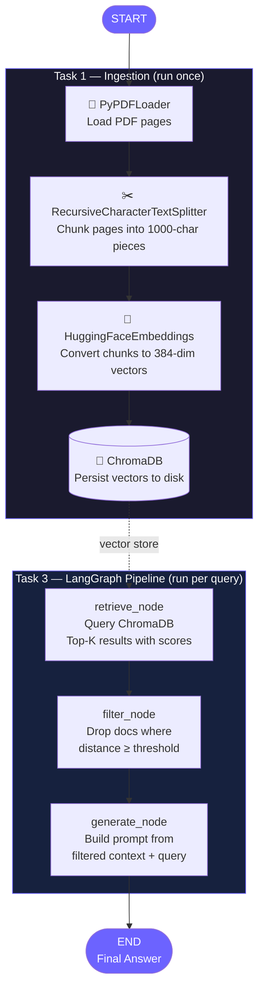

<div align="center">

<!-- Animated SVG Banner -->


<br/>

<!-- Tech Badges -->


<br/>

**A hands-on, step-by-step RAG pipeline — built one layer at a time, with real output at every stage.**

</div>

---

## What is this?

This project builds a **Retrieval-Augmented Generation (RAG)** system from scratch using:
- **LangChain** — for loading PDFs, splitting text, and embedding
- **ChromaDB** — as a local vector database (no server, no cloud)
- **LangGraph** — to wire it all into a stateful, traceable pipeline

It is structured as **3 progressive tasks**, each building on the previous one, so you can understand exactly what is happening at every step before moving forward.

---

## The Mental Model

Before touching any code, understand the core idea:

> A RAG system answers questions by first *finding* relevant text from your documents, then *feeding* that text to an LLM as context. The LLM never "reads" your PDF — it only sees the chunks you hand it.

```
Your Question
     │
     ▼
[Convert question to a vector]        ← same math as during ingestion
     │
     ▼
[Find nearest vectors in the DB]      ← cosine similarity search
     │
     ▼
[Filter out low-quality matches]      ← score threshold
     │
     ▼
[Send remaining text to the LLM]      ← as context in the prompt
     │
     ▼
Answer
```

---

## Pipeline Architecture



---

## Project Structure

```
rag-langgraph-pipeline/
│
├── pdfs/                          ← drop your PDF files here
│
├── utils/
│   ├── embeddings.py              ← shared embedding model (one place to change)
│   └── vectorstore.py             ← shared ChromaDB connection
│
├── 1_ingest.py                    ← Task 1: Load → Chunk → Embed → Store
├── 2_query.py                     ← Task 2: Query ChromaDB directly
├── 3_langgraph_pipeline.py        ← Task 3: Full LangGraph RAG pipeline
│
├── requirements.txt
├── .env.example
└── README.md
```

---

## Setup

```bash
# 1. Clone the repo
git clone https://github.com/shivanshinigam/rag-langgraph-pipeline.git
cd rag-langgraph-pipeline

# 2. Create a virtual environment
python -m venv venv
source venv/bin/activate          # Windows: venv\Scripts\activate

# 3. Install dependencies
pip install -r requirements.txt

# 4. Configure environment
cp .env.example .env
# Open .env and add your OPENAI_API_KEY (optional — works without it)

# 5. Drop your PDFs into the /pdfs folder
```

---

## Task 1 — PDF Ingestion

**Goal:** Load PDFs from disk, split them into chunks, convert to vectors, store in ChromaDB.

### Run
```bash
python 1_ingest.py
```

### What happens inside

| Step | Tool | What it does |
|------|------|-------------|
| 1 | `PyPDFLoader` | Reads each PDF and returns one `Document` per page |
| 2 | `RecursiveCharacterTextSplitter` | Breaks pages into chunks (tries `\n\n` → `\n` → ` ` → char) |
| 3 | `HuggingFaceEmbeddings` | Converts each chunk's text into a 384-number float vector |
| 4 | `Chroma.from_documents()` | Calls embedding for each chunk and saves vectors to disk |

### Why chunk at all?
> A 15-page PDF has too much text to embed meaningfully as one unit.
> By splitting into small chunks, each chunk represents **one idea**.
> This makes similarity search precise — you get the right paragraph, not the whole document.

### Why overlap?
```
Chunk 1:  [.......text.......|overlap|]
Chunk 2:              [|overlap|.....text.......]
```
> The overlapping region ensures no idea gets split mid-sentence across two chunks and lost.

### Real output

```
Starting Task 1: PDF Ingestion Pipeline
------------------------------------------------------------
Found 1 PDF(s) in './pdfs'

  Loading: attention_is_all_you_need.pdf
  Loaded 15 pages

Total pages loaded: 15

Splitting documents into chunks...
  chunk_size=1000, chunk_overlap=200
  Created 52 chunks from 15 pages

Embedding 52 chunks and storing in ChromaDB...
  Collection : rag_docs
  Persist dir: ./chroma_db
  Successfully stored 52 vectors in ChromaDB!

------------------------------------------------------------
Task 1 Complete!
  Vector database saved at : ./chroma_db/
  Collection name          : rag_docs
  Total vectors stored     : 52
```

### Run statistics

| Metric | Value |
|--------|-------|
| PDF loaded | `attention_is_all_you_need.pdf` (Vaswani et al., 2017) |
| Pages | 15 |
| Chunks created | 52 |
| Chunk size | 1,000 characters |
| Chunk overlap | 200 characters |
| Embedding model | `sentence-transformers/all-MiniLM-L6-v2` |
| Vector dimensions | 384 |
| Storage | ChromaDB on disk (`./chroma_db/`) |

---

## Task 2 — Querying the Vector Store

**Goal:** Understand how similarity search works by querying ChromaDB directly and reading the scores.

### Run
```bash
python 2_query.py "What is multi-head attention?"
python 2_query.py "How does the encoder work?"
python 2_query.py "What optimizer was used for training?"
```

### How similarity search works

```
1. Your query text is embedded into a vector    →  [0.12, -0.34, 0.89, ...]
2. ChromaDB compares it against all 52 stored vectors
3. It measures the "angle" between vectors (cosine distance)
4. Returns the closest matches ranked by distance
```

**Cosine Distance → Relevance:**
```
distance = 0.0  →  100%  (identical meaning)
distance = 0.7  →   65%  (very relevant)
distance = 1.0  →   50%  (borderline)
distance = 1.5  →   25%  (probably noise)
distance = 2.0  →    0%  (completely unrelated)

Formula: relevance % = (1 - distance / 2) × 100
```

### Real output — 3 queries

**Query 1:** `"What is multi-head attention?"`
```
Rank #1  |  Relevance: 59.5%  (distance: 0.8108)  |  Page 3
  "An attention function can be described as mapping a query and a set of
   key-value pairs to an output..."

Rank #2  |  Relevance: 56.1%  (distance: 0.8778)  |  Page 5
  "MultiHead(Q,K,V) = Concat(head_1,...,head_h) W^O
   where head_i = Attention(QW^Q_i, KW^K_i, VW^V_i)..."

Rank #3  |  Relevance: 50.2%  (distance: 0.9963)  |  Page 5
  "The Transformer uses multi-head attention in three different ways..."
```

**Query 2:** `"What optimizer was used for training?"`
```
Rank #1  |  Relevance: 41.8%  (distance: 1.1650)  |  Page 7
  "We trained our models on one machine with 8 NVIDIA P100 GPUs..."

Rank #2  |  Relevance: 33.3%  (distance: 1.3348)  |  Page 7
  ...
```
> **Note:** Low scores here are expected — the paper uses "Adam" and "training regime",
> not the word "optimizer". This is exactly why Task 3 has a filter node.

**Query 3:** `"How does the encoder work?"`
```
Rank #1  |  Relevance: 63.8%  (distance: 0.7231)  |  Page 2
  "The encoder maps an input sequence (x1,...,xn) to continuous
   representations z = (z1,...,zn)..."

Rank #2  |  Relevance: 54.2%  (distance: 0.9161)  |  Page 5
  ...
```

---

## Task 3 — LangGraph Pipeline

**Goal:** Wire the retrieval and filtering into a proper stateful graph using LangGraph.

### What is LangGraph?

Instead of calling functions manually, LangGraph lets you define:

| Concept | What it is |
|---------|-----------|
| **Node** | A Python function that reads from state and returns updates |
| **Edge** | A connection defining which node runs next |
| **State** | A shared `TypedDict` that flows through every node |
| **Graph** | The assembled structure of nodes + edges |

### The State Schema

```python
class RAGState(TypedDict):
    query         : str                           # set at START, never changes
    raw_docs      : list[tuple[Document, float]]  # (doc, cosine_distance)
    filtered_docs : list[Document]                # passed threshold
    answer        : str                           # set at END
```

Every node reads from this dict and writes back only the keys it owns. No global variables. No manual passing of arguments.

### The three nodes

**Node 1 — `retrieve_node`**
```python
def retrieve_node(state: RAGState) -> dict:
    results = vectorstore.similarity_search_with_score(state["query"], k=10)
    return {"raw_docs": results}
```
Reads: `query` → Writes: `raw_docs`

**Node 2 — `filter_node`**
```python
def filter_node(state: RAGState) -> dict:
    filtered = [doc for doc, dist in state["raw_docs"] if dist < THRESHOLD]
    return {"filtered_docs": filtered}
```
Reads: `raw_docs` → Writes: `filtered_docs`

**Node 3 — `generate_node`**
```python
def generate_node(state: RAGState) -> dict:
    context = "\n\n".join(doc.page_content for doc in state["filtered_docs"])
    answer  = llm.invoke(f"Context:\n{context}\n\nQuestion: {state['query']}")
    return {"answer": answer}
```
Reads: `filtered_docs`, `query` → Writes: `answer`

### Graph assembly

```python
graph = StateGraph(RAGState)

graph.add_node("retrieve", retrieve_node)
graph.add_node("filter",   filter_node)
graph.add_node("generate", generate_node)

graph.add_edge(START,      "retrieve")
graph.add_edge("retrieve", "filter")
graph.add_edge("filter",   "generate")
graph.add_edge("generate", END)

app = graph.compile()
result = app.invoke({"query": "What is multi-head attention?"})
```

### Real output

**Query 1 — Filter passes (3 docs kept)**
```
LangGraph RAG Pipeline  —  START → retrieve → filter → generate → END
------------------------------------------------------------
Threshold : distance < 1.0  (relevance > 50%)
Top-K     : 10

[Node 1: RETRIEVE]
  Retrieved : 10 documents
    #1   distance=0.8108   relevance=59.5%   page=3
    #2   distance=0.8778   relevance=56.1%   page=5
    #3   distance=0.9963   relevance=50.2%   page=5
    #4   distance=1.0268   relevance=48.7%   page=13   ← cut here
    ...

[Node 2: FILTER]
  KEEP  distance=0.8108   relevance=59.5%   page=3
  KEEP  distance=0.8778   relevance=56.1%   page=5
  KEEP  distance=0.9963   relevance=50.2%   page=5
  DROP  distance=1.0268   relevance=48.7%   page=13
  DROP  ... (7 more dropped)
  Kept: 3  |  Dropped: 7

[Node 3: GENERATE]
  Context docs : 3
  → Sending to LLM with 3 high-quality chunks as context
```

**Query 2 — Filter rejects everything (correct behavior)**
```
[Node 1: RETRIEVE]
  Retrieved : 10 documents
    #1   distance=1.1650   relevance=41.8%   page=7   ← best score is still too low
    ...

[Node 2: FILTER]
  DROP  (all 10 documents)
  Kept: 0  |  Dropped: 10

[Node 3: GENERATE]
  No relevant documents found above the relevance threshold.
  → Pipeline refuses to answer rather than hallucinate
```

### Pipeline summary

| Query | Retrieved | Kept | Dropped | Outcome |
|-------|-----------|------|---------|---------|
| "What is multi-head attention?" | 10 | 3 | 7 | Sent to LLM |
| "What optimizer was used?" | 10 | 0 | 10 | Correctly rejected |

---

## Understanding Score Thresholds

The threshold is **not a fixed number** — it depends on your embedding model and your tolerance for noise.

```
all-MiniLM-L6-v2 distance ranges:
  0.7 – 0.9   →  strong match    →  always keep
  0.9 – 1.1   →  moderate match  →  keep if threshold is lenient
  1.1 – 1.4   →  weak match      →  usually drop
  1.4+        →  no match        →  always drop
```

| Situation | Adjust threshold |
|-----------|-----------------|
| Too many irrelevant answers from LLM | Lower it (stricter) |
| Too many "no results found" responses | Raise it (more lenient) |
| Switching embedding models | Re-calibrate from scratch |
| User-facing product | Error on strictness — "I don't know" is better than hallucination |

---

## Key Concepts Reference

| Concept | One-line explanation |
|---------|---------------------|
| `Document` | LangChain's base unit — text + metadata (source, page) |
| `PyPDFLoader` | Reads a PDF, returns one `Document` per page |
| `RecursiveCharacterTextSplitter` | Splits text by paragraph → sentence → word → character |
| `chunk_overlap` | Shared text between adjacent chunks — preserves boundary context |
| `HuggingFaceEmbeddings` | Local model, no API key — converts text to float vectors |
| `Chroma.from_documents()` | Embed + store in one call |
| `similarity_search_with_score()` | Returns `(Document, cosine_distance)` pairs ranked by relevance |
| `RAGState` | Shared `TypedDict` flowing through all LangGraph nodes |
| `StateGraph` | LangGraph's graph builder — registers nodes and edges |
| `graph.compile()` | Validates and locks the graph into a runnable `app` |
| `app.invoke(state)` | Executes the full graph from start to end |

---

## What's Next

- [ ] Add a **conditional edge** — retry with a lower threshold if 0 docs pass
- [ ] Add a **rerank node** — re-score results using a cross-encoder model
- [ ] Add **memory** — persist chat history across queries using LangGraph checkpointers
- [ ] Swap in **OpenAI embeddings** — set `OPENAI_API_KEY` and update `utils/embeddings.py`
- [ ] Add a **web UI** — wrap the pipeline in a Streamlit or FastAPI interface

---

<div align="center">

Built step by step. Every line of output is real.

</div>
